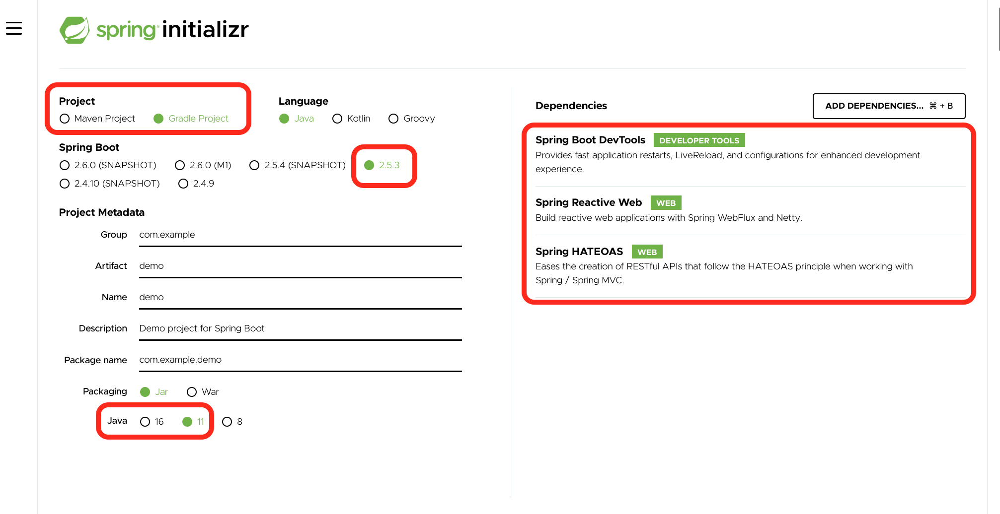

# Getting Started

## Generate the application

Generate an application from https://start.spring.io/

1. Under Java use a modern version such as 11+
1. Add Dependencies
    1. Spring Reactive Web
    1. Spring HATEOAS
    1. (optional) Spring Boot DevTools



You can go directly to [this link](https://start.spring.io/#!type=gradle-project&language=java&platformVersion=2.5.3.RELEASE&packaging=jar&jvmVersion=11&groupId=com.example&artifactId=demo&name=demo&description=Demo%20project%20for%20Spring%20Boot&packageName=com.example.demo&dependencies=devtools,webflux,hateoas).

Download the application, unzip, and open in your IDE.

## Add properties

In `src/main/resources/application.properties` add:

```
spring.main.web-application-type=reactive
```

## See Examples

- [IssuesController](src/main/java/io/upslope/hypermedia/issues/IssuesController.java)
- [APIController](src/main/java/io/upslope/hypermedia/APIController.java)

## Reference Documentation

For further reference, please consider the following sections:

* https://medium.com/@cheron.antoine/reactor-java-1-how-to-create-mono-and-flux-471c505fa158
* 
* https://howtodoinjava.com/spring5/hateoas/spring-hateoas-tutorial/
* https://grapeup.com/blog/how-to-build-hypermedia-api-with-spring-hateoas/
* [Spring HATEOAS](https://docs.spring.io/spring-boot/docs/2.5.3/reference/htmlsingle/#boot-features-spring-hateoas)
* [Building a Hypermedia-Driven RESTful Web Service](https://spring.io/guides/gs/rest-hateoas/)
